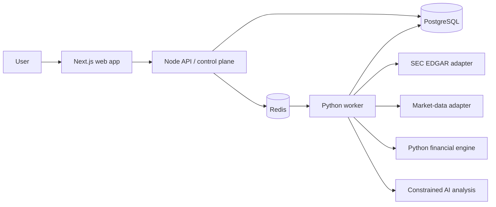

# ForgeFlow Intelligence MVP Architecture

## Product definition

ForgeFlow turns one US public-company ticker into a durable, evidence-backed
research report. It combines public company and SEC filing metadata, historical
market data, deterministic financial calculations, and a constrained AI
explanation.

The system is a research and decision-support product. It is not an investment
advisor, a source of unsourced financial facts, an autonomous trading system,
or a general-purpose workflow platform in the MVP.

## MVP outcome

For a valid ticker such as `MSFT`, a user can submit a company-analysis
workflow, observe its persisted progress, and view a completed report. The
report contains source-linked facts, reproducible calculations, source-grounded
AI analysis, and explicit unavailable values. A controlled worker crash is
recovered through a lease timeout and retry.

### Remaining deferred scope

- Multi-tenancy and user-owned portfolios.
- Company comparison, paper trading, backtesting, and real-money trading.
- Kubernetes, Kafka, and generated-code sandboxing.
- Generic user-authored workflows and unrestricted agent tools.

## Components

| Component         | MVP responsibility                                                                                             |
| ----------------- | -------------------------------------------------------------------------------------------------------------- |
| Web               | Submit a ticker, poll workflow progress, and render typed report items safely.                                 |
| API/control plane | Validate requests, create workflows atomically, expose read APIs, and own server-defined workflow definitions. |
| PostgreSQL        | Authoritative durable state for workflows, tasks, attempts, provenance, calculations, and reports.             |
| Redis             | Queue wakeups and low-latency coordination only; it is not the source of workflow truth.                       |
| Python worker     | Claim leased tasks, invoke adapters, normalize data, run calculations, and publish task outcomes.              |
| Financial engine  | Perform deterministic, versioned calculations only.                                                            |
| AI integration    | Generate structured explanations from an allow-listed source set; it cannot create authoritative data.         |

## Public API boundary

`POST /workflows/company-analysis` receives `{ "ticker": "MSFT" }` and
returns a workflow identifier after the workflow and its task graph commit.
`GET /workflows/{id}` returns workflow, task, attempt, and progress state.
`GET /reports/{workflowId}` returns report items classified as `FACT`,
`CALCULATION`, `AI_ANALYSIS`, or `UNAVAILABLE`, including source references.

The initial deployment is single-tenant. These endpoints must still avoid
exposing internal lease tokens, provider credentials, prompts, or raw secrets.

## Data flow

1. The web app validates and submits an uppercase ticker to the API.
2. The API validates it, persists a workflow run and server-defined DAG in one
   PostgreSQL transaction, then notifies workers through Redis.
3. Workers atomically lease independent SEC, company-profile, and market-price
   retrieval tasks. Each source response is stored with provider, URL, time,
   content hash, and document context.
4. Follow-on tasks normalize data and create facts or explicit unavailable
   values. The Python engine calculates only metrics whose validated inputs are
   available and stores formula/version/input provenance.
5. A constrained AI task receives only approved facts and sources, emits a
   structured explanation, and is rejected if its citations are not in that
   approved set.
6. The report task assembles typed items and source links. The web app renders
   the persisted result and workflow timeline.

## Reliability model

PostgreSQL is authoritative. Workers use transactional task claims, opaque
lease tokens, heartbeats, persisted retry schedules, and immutable attempt
records. A lost worker eventually loses its lease and another worker may retry
the task.

The system provides **at-least-once task execution**. Handlers must therefore
be idempotent. Database writes use unique effect keys and transactional state
changes to provide effectively-once persistence for designed operations. The
system does not claim exactly-once execution for provider calls or any external
side effect.

## Pilot release extension

The invite-only pilot adds AWS-managed deployment, Google Workspace SSO, and
constrained OpenAI explanation while preserving durable workflow and provenance
boundaries. Decisions are recorded in
[ADR-006](adr/ADR-006-aws-pilot-topology.md),
[ADR-007](adr/ADR-007-google-workspace-access.md), and
[ADR-008](adr/ADR-008-external-data-and-ai-pilot-boundary.md). Live SEC EDGAR
is allowed only through the configured compliance boundary; market data remains
explicitly unavailable until a licensed vendor is approved.

## MVP success criteria

- A known US ticker creates a durable workflow and survives an API restart.
- Independent source tasks can execute concurrently, while dependent tasks do
  not execute early.
- Every displayed fact or calculation has provenance; unknown data remains
  visibly unavailable.
- Financial arithmetic runs in Python with documented formulas and inputs.
- An AI explanation cannot become an authoritative fact or metric.
- A controlled worker crash recovers to a visible retry and an explainable
  terminal workflow state.
